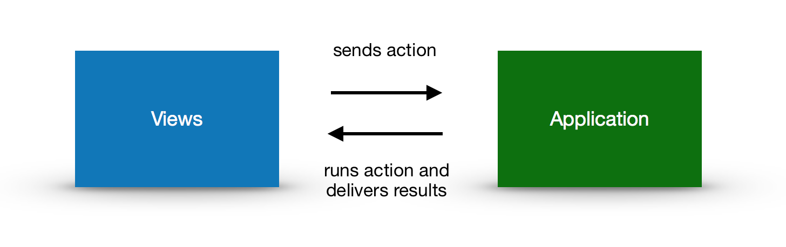

# Smartflow

Smartflow is an application flow library for JavaScript.

The purpose of the API is to solve the repetitive JavaScript development tasks. How to keep application flow and states 
predictable and easy to develop with when the application flow grows.

All state changes are done by a View (controller) that performs an action. The actions are queued are done in strict 
serial order. Actions are guaranteed to report when its done. No timeouts or silent errors. Since the actions are using 
instructions in JSON format, documentation of the whole application with its flow is possible.

**Overview**




**Features**

- handling user actions
- managing application states
- booting the application
- loading language files 
- detecting the appropriate language for the user
- navigating between views (routing)
- to simplify XHR communication

## Application

The application has the following methods:

| Method             | Description                                   |
|:------------------ |:----------------------------------------------| 
| setConfig          | Loads the REST configuration                  |
| setDefaultLocale   | Sets the default locale                       |
| loadLanguage       | Loads a language file                         | 
| addView            | Adds a view controller                        |      
| removeView         | Removes a view controller                     |  
| start              | Starts the application                        |

## View

A view is responsible for managing user interface components for a specific part of the application. It makes sure that 
the user interface is updated with the data from the state by receiving events from the application whenever a state 
change occurs.

Views are limited to one method of communicating with the application and that is the method to ask the application to 
run an action. The application will send events the the views when 

- a view should be initialized
- a view is enabled og disabled 
- one or more states changes
- an action was performed

All views are required to be mapped to a specific path (using the HTML anchor). The mapping is done using a JSON field 
inside the view called smartflow. The view responds to all request with the path starting with «/compose/» . Views 
cannot have overlapping paths.

### Events

The controllers receives events when the application changes state.

| Event              | Description                                   | Parameters      |
|:------------------ |:----------------------------------------------|:----------------| 
| viewInitialized    | The view is initialized                       | language        |
| viewEnabled        | The view was enabled                          |                 |
| viewDisabled       | The view was disabled                         |                 | 
| actionPerformed    | The specified action was performed            | actionEvent     |      
| stateChanged       | The state change to the value                 | state, value    |    
| pathChanged        | The path changed                              | path, parameters|    

### Examples

**Declaring paths in the view**

```javascript
function ComposeView(){
  this.smartflow = {
    "path" : "/compose"
  }; 
```


**Adding view to the application**

```javascript
var app = new Smartflow();
app.addView(new ComposeView()); 
```


## Actions

Actions changes the states and internal navigation in the application. Their behavior is declared as a JSON object
inside an action. When an action is performed by the application, the view(s) are informed about the changes in states 
(stateChanged) and the application will potentially navigate to a different path (pathChanged). The destination view
for the application will be informed about the completion (actionPerformed).


### Client actions

Actions that does not involve any communication with a server is a client action. A client action is limited to change
states and path.

#### Declaring the behavior

| Node        | Description                                   | Required        |
|:------------|:----------------------------------------------|:----------------| 
| states      | Specifies the state names and their values    | no              |
| path        | The path to navigate to                       | no              |

#### Example

Declaring to navigate to /compose after setting two states

```javascript
function ComposeAction(){
  this.smartflow = {
    "path" : "/compose",
    "states": {
        "to": "nobody@nothing.org",
        "subject": "Hello world"
    }
  };
}
```

### Server actions

Usable for using REST services and other XHR requests.

#### Declaring the behavior

| Smartflow       | Description                                                 | Required        |
|:----------------|:------------------------------------------------------------|:----------------| 
| state           | The name of the state to put the response into              | yes             |
| request.url     | The url to connect to                                       | no              |
| request.method  | The method to use while connecting. Default: GET            | no              |
| success.path    | The path to navigate to when successful                     | yes             |
| success.state   | The state to set the to when successful                     | yes             |
| error.path      | The path to navigate to if an error occurs                  | yes             |
| error.state     | The name of the state to set the error message details into | yes             |

#### Example

Declares how to connect to "/api/login" using a get request and setting the results in the state with the name
"user" and navigating to /inbox. If the operation fails, the state "loginFailed" will be willed with the 
error message then the application navigates to the path "/".

```javascript
function LoginAction() {
  this.smartflow = {
    "request": {
      "url": "/api/login",
      "method": "get"
    },
    "success": {
      "path": "/inbox",  
      "state": "user",  
    },
    "error": {
      "path": "/",
      "state": "loginFailed"
    }
  };
}
```


### Action event

The action event contains essential information about the action and its results.

| Json                  | Description                                                   |
|:----------------------|:--------------------------------------------------------------|
| action.name	          | The name of the action                                        |
| action.value         	| The original smartflow instructions                           |
| states	              | Contains JSON values of all states that changed               |
| error	                | Whenever an error occurs this value will be set to a string   |
| request.method        | The http method when using XHR                                |
| request.url	          | The URL for when using XHR                                    |
| response.status *	    | The status the XHR found                                      |
| response.body *	      | The body the XHR found                                        |
| response.contentType  | The contentType the XHR found                                 |
| path	                | The new path                                                  |
| from	                | The original path before the action was called                |
| start	                | The time when the action was started                          |
| finish	              | The time when the action was finished                         |

* Only available when performing server actions

#### Example

```json
{
  "action": {
    "name": "SendMailAction",
    "value": "smartflow data will be here"
  },
  "states": {
    "userID": 12,
     "first": "Donald"
  },
  "error": "Failed to send email.",
  "request": {
    "method": "post",
    "url": "/api/sendmail"
  },
  "response": {
    "status": 500,
    "body": "500 Internal server error",
    "contentType": "text/plain",
  },
  "path": "/inbox",
  "from": "/compose",
  "start": 1502574531068,
  "finish": 1502574531068
}
```

## Configuration

The server actions specifies their URLs to use. These URLs can be controlled by using a config file that contains one or 
more name URLs. The application first looks for a configuration and uses that - otherwise the URL in the action is used 
instead. If an action is called LoginAction, the configuration key must have the same name.


**Example:**

```javascript
function LoginAction(){
  this.smartflow = {
    "url" : "/api/login"
  };
} 

var config = {
  "LoginAction": "/api/login",
  "DeleteAction": "/api/delete"
};

var app = new Smartflow();
app.setConfig( config );
```

## Internationalisation

Using multiple language is supported by loading a JSON object for each language and bind it to a specific locale. If the 
language detected by the browser is not supported, the default language will be used. The translation for each entry is 
achieved by using a formatter object when the controller is initialised.

Formatting strings with multiple parameters is also supported.

### Setting default language

**Example:**

```javascript
var app = new Smartflow();
app.setDefaultLocale(«en»);
```

### Loading language files

**Example:**

```javascript
var lang = {
  "confirmdelete": "Are you sure you want to delete?",
  "deleted" : "Deleted"
}
var app = new Smartflow();
app.loadLanguage("en", lang);
```

### Formatting strings

When a view is initialised the language formatter is provided as a parameter to the controller.

**Example:**

```javascript
function ToolbarView(){
  this.viewInitialized = function(formatter){
  };
}
```
The formatter can format text with a single parameter.

**Example:**

```javascript
var lang = {confirmDelete: 'Are you sure you want to delete the file {0}?'}
formatter.format( 'confirmDelete', 'helloWorld.txt' );
```

**Example:**

```javascript
var lang = {confirmDelete, 'Are you sure you want to delete the file {filename}?'}
formatter.format( 'confirmDelete', {  filename: "helloWorld.txt" } )
```

## Example

The following example shows how to use the API.

```javascript
function LoginView(){
    
}

var app = new Smartflow();
app.setConfig()
app.addView(new LoginView());
app.start();

```


## Installation

Install with [npm](https://www.npmjs.com/):

```sh
$ npm install smartflow --save
```

## License

Apache License 2.0

